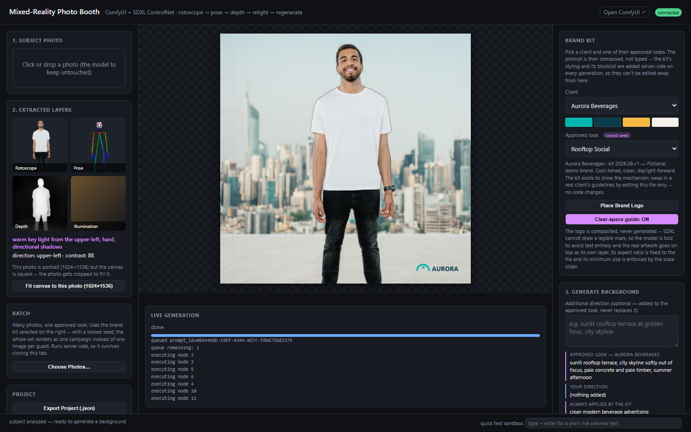
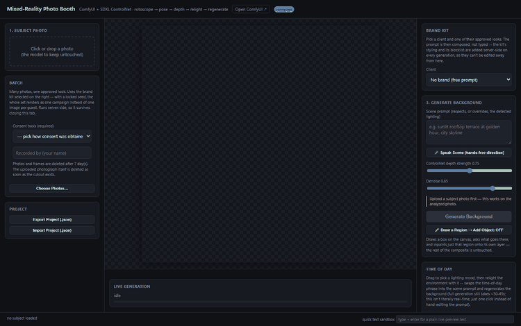
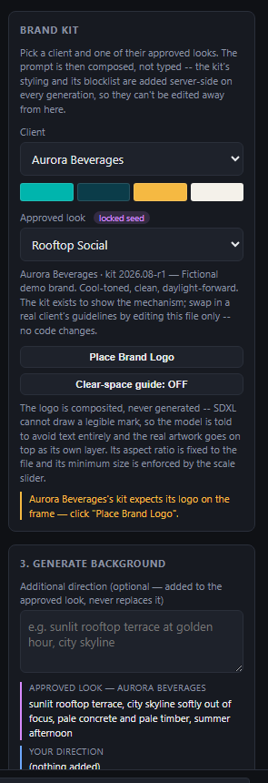
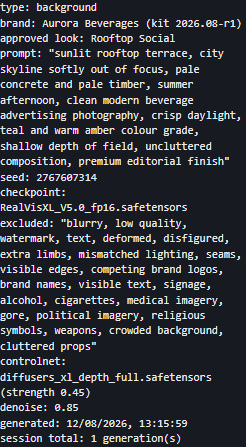
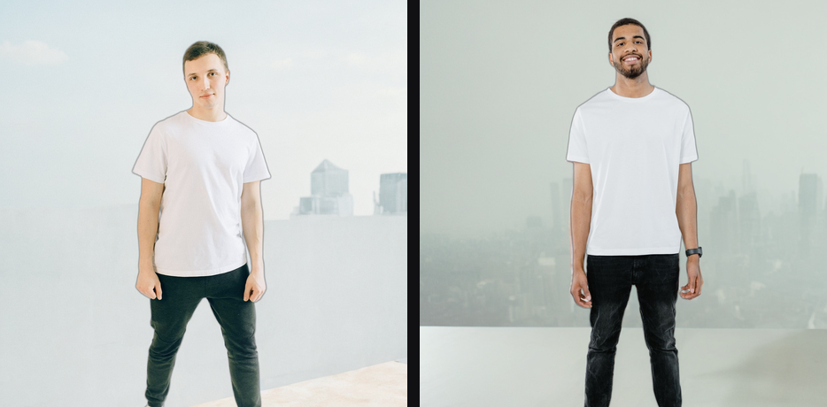

# Mixed-Reality Photo Booth

[](https://github.com/BGavazzi/mixed-reality-photobooth/actions/workflows/tests.yml)

A browser app that photographs a person and replaces the world around them,
without ever regenerating the person.

It extracts what's needed to rebuild the environment (rotoscope, pose, depth,
lighting direction), generates a new depth-conditioned background in ComfyUI,
and composites the untouched original subject back on top. The denoising
preview streams into the browser as it renders.



<p align="center">
  
</p>

The whole point is in that image: the subject's actual pixels are never
re-generated. Only the region *around* them is, conditioned on their real
pose and depth so the new environment stays geometrically consistent — then
the original cutout goes back on top.

| | |
|---|---|
|  |  |
| The deliverable: real subject, generated rooftop, brand logo composited (never generated). | The operator picks a client and an approved look. The prompt is composed server-side, not typed. |

---

## Contents

- [What's interesting in here](#whats-interesting-in-here)
- [Run it](#run-it) · [with Docker](#with-docker)
- [Brand kits](#brand-kits--making-a-generation-something-a-client-can-sign-off-on)
- [Batch mode](#batch-mode--many-photos-one-approved-look)
- [Architecture](#architecture)
- [Testing](#testing)
- [Known limitations](#known-limitations)
- [Also in this repo: the Resolume VJ bridge](docs/resolume-bridge.md)

---

## What's interesting in here

Not "it calls an image API". The parts worth reading:

| | |
|---|---|
| **A websocket relay, not polling** | One persistent connection to ComfyUI's own websocket, relayed per-session to the right browser tab — progress, executing-node, and binary mid-denoise preview frames. [→](#why-a-websocket-relay-instead-of-just-polling) |
| **Brand kits enforced server-side** | The client sends `{brand_id, look_id, free text}` and never a finished prompt, because a locked negative the client assembles is one a stale client can drop. [→](#brand-kits--making-a-generation-something-a-client-can-sign-off-on) |
| **A locked seed makes a set** | 200 guests used to mean 200 unrelated images. A seed derived from (brand, look) makes them one campaign. [→](#batch-mode--many-photos-one-approved-look) |
| **A real queue seam** | Bounded worker pool with admission control in front of a serial GPU, behind an interface a Redis/Celery version could satisfy unchanged. [→](#the-queue) |
| **Workflow roles resolved from the graph** | No hardcoded node IDs: `workflow_graph.py` walks the wiring to find the sampler, the encoders, the ControlNet. Re-export from ComfyUI and it still works. [→](#workflow-roles-instead-of-magic-node-ids) |
| **Findings from real photos** | Four failures that a curated 1024×1024 test image never shows. [→](#real-photo-hardening) |

## Run it

**One command.** It creates `.venv`, installs what's needed, and finishes by
telling you what (if anything) is still missing:

```
powershell -ExecutionPolicy Bypass -File install.ps1     # Windows
./install.sh                                             # macOS / Linux
```

Then:

```
powershell -ExecutionPolicy Bypass -File start_demo.ps1
```

which starts ComfyUI (with `--preview-method auto`), waits for it, checks the
checkpoint and ControlNet the workflow names are actually installed (via
ComfyUI's `/object_info`, so a missing model is reported at startup instead of
~40s into the first generation), starts `web_server.py`, and opens the browser.
`stop_demo.ps1` shuts both down.

Or manually, against a ComfyUI you're already running:

```
python web_server.py     # http://127.0.0.1:8000
```

<details>
<summary>Installing by hand, and what each requirements file is for</summary>

```
python -m venv .venv
.venv\Scripts\activate          # source .venv/bin/activate on macOS/Linux
pip install -r requirements.txt
python doctor.py
```

| file | what it's for |
|---|---|
| `requirements.txt` | the photo booth — all you need for the primary demo |
| `requirements-resolume.txt` | the OSC bridge + Spout output (Windows for Spout) |
| `requirements-backends.txt` | hosted Runway / Kling backends |
| `requirements-test.txt` | the offline test suite |

Expect roughly **2GB and a few minutes** on a cold cache: `controlnet_aux` pulls
in torch, torchvision, timm, scipy and scikit-image.

Requirements are split so nobody installs a Windows-only package to try the
browser app.

</details>

<details>
<summary>Something not working? Run the doctor</summary>

```
python doctor.py              # photo booth
python doctor.py --all        # every optional piece too
```

It checks the Python version, every package (naming what breaks without each
one), which OpenCV build you ended up with, whether ComfyUI is reachable,
whether the models the workflow names are actually on disk, whether every
workflow's node roles still resolve, and whether the installed brand kits are
valid — printing the exact command to fix each problem. It imports nothing
outside the standard library, so it runs on a bare interpreter *before* anything
is installed, and exits non-zero only for things that would genuinely stop the
app.

</details>

### Models

ComfyUI needs two files (the app checks for both at startup and `doctor.py`
reports them):

- Checkpoint: [`RealVisXL_V5.0_fp16.safetensors`](https://huggingface.co/SG161222/RealVisXL_V5.0) in `models/checkpoints/`
- ControlNet: [`diffusers_xl_depth_full.safetensors`](https://huggingface.co/lllyasviel/sd_control_collection) in `models/controlnet/`

The rotoscope/pose/depth models (`birefnet-portrait`, OpenPose, MiDaS) download
themselves on first use via `rembg`/`controlnet_aux` — the first photo you
analyze will be slower than the rest.

### With Docker

```
docker compose up photobooth                  # app only, against a ComfyUI you already run
docker compose --profile gpu up               # app + a GPU ComfyUI container
```

The image contains the app and its CV pipeline, and **deliberately not
ComfyUI**: they have different hardware needs and wildly different image sizes,
and coupling them would mean rebuilding multiple gigabytes to change a line of
Python. `COMFY_ADDRESS` points the container at ComfyUI wherever it lives —
another container, another host on the LAN, a GPU box entirely.

Two things worth knowing if you edit the Dockerfile:

- It installs **CPU torch explicitly** before the requirements. On Linux, pip's
  default `torch` is the CUDA build: ~6GB of nvidia wheels for a container that
  never touches a GPU. That one line is the difference between a 9.4GB image and
  a 2.9GB one.
- Model weights live on a volume (`U2NET_HOME`, `TORCH_HOME`, `HF_HOME`), so a
  rebuilt container doesn't re-download them.

The healthcheck's `start_period` is 180s because the app is genuinely not
answering until the model warmup finishes — a short interval would just flap
during startup and mark a healthy container unhealthy.

## Brand kits — making a generation something a client can sign off on

A free-text prompt box is fine for a personal tool and unusable for branded
work. Three things were wrong with it, and a brand kit fixes each:

| Problem | Before | Now |
|---|---|---|
| Nothing was repeatable | `seed = uuid4()` on every call — 200 guests, 200 unrelated images | `seed_policy: locked` derives a stable seed from (brand, look) |
| Nothing was enforced | The negative prompt was welded into the workflow JSON, unreviewable and unreachable from the API | The kit's blocklist is appended server-side to every generation |
| Nothing was recorded | Provenance named the model and seed, not the client or the approved look | Brand, kit revision, approved look, operator's addition and the exclusion list all land in the disclosure |

A kit is a directory under `brands/` holding a `brand.json` and its logo
artwork. The operator picks a client and one of that client's **approved
looks**; the prompt is then composed, not typed:

```
approved look   ->  "seamless white studio backdrop"        (from the kit)
operator adds   ->  "with a red chair"                      (free text, optional)
kit styling     ->  "clean editorial finish"                (always appended)
kit blocklist   ->  "competitor logos, alcohol, ..."        (always excluded)
```

Free text can only ever be *added* to what the kit mandates. The approved look
leads because SDXL weights leading tokens most heavily, so an operator's
addition colours the scene instead of displacing it.

**Composition happens on the server** (`brand_kit.compose`, called from
`web_server.py`), not in the browser. The page sends `{brand_id, look_id, free
text}` and never a finished prompt — a locked negative that the client assembles
is a locked negative a modified or stale client can drop, which would make the
guarantee decorative. `tests/test_brand_enforcement.py` asserts this directly,
including that a request trying to pass its own `negative_prompt` or `seed` is
ignored.

Every generation records what produced it:

<p align="center"></p>

The region-draw tool inherits the kit's **blocklist but not its styling**:
"never generate a competitor's logo" is a rule about every pixel, while "rugged
outdoor photography, film grain" describes a scene and reads as noise when
what's being generated is one prop inside an existing one. The region label is
also the only prompt in the app typed live at a booth, so it is the one the
blocklist most needs to reach.

### The logo is composited, never generated

SDXL cannot draw a legible mark — this is why `text, watermark` sits in the
workflow's negative prompt in the first place. So the model is told to keep text
out of the frame, and the real artwork goes on top as its own layer. Unlike
every other layer it is **contain**-fit rather than cover-fit, with its height
derived from the file's own aspect ratio, so the single most common
brand-guideline violation in the wild — a stretched logo — is not expressible in
the UI. Two more rules from the kit are enforced live:

- `min_width_pct` — the scale slider's floor moves so the mark cannot be shrunk
  below legibility.
- `clear_space_pct` — a dashed guide on the canvas, and a warning if the logo is
  dragged outside it. A warning rather than a clamp, because position is a
  judgement call in a way that minimum size is not. The guide is an editing aid
  and is suppressed from the exported PNG, the .webm and the live Spout feed.

Two fictional demo kits ship with the repo (`brands/aurora`, `brands/northwind`)
with generated placeholder artwork — see `brands/_make_demo_logos.py`. Adding a
real client is a file drop, not a code change. Running with no `brands/`
directory at all is supported and gives you exactly the free-prompt tool that
existed before.

## Batch mode — many photos, one approved look

The interactive app is one photo at a time, which is the wrong shape for what
it's actually for: a shoot produces dozens of frames and a client expects them
to look like one campaign.



*Two different subjects, one batch, one locked seed — same treatment, same
palette, same skyline handling.*

From the browser ("Choose Photos…"), or from a shell:

```
python batch_cli.py photos/ --brand aurora --look coastline -o shoot.zip
```

The CLI is a *client* of `POST /api/batch`, not a second implementation, so
there is one code path through the queue, the brand kit and the compositor. It
exists because a batch is the one operation here that genuinely doesn't want a
browser: it runs for half an hour, it outlives the page, and it starts from a
directory of files that already exist on disk.

Design decisions worth knowing:

- **Runs live on disk, not in memory.** Each photo's cutout/mask/depth is
  written to the run directory and reloaded when its generation finishes.
  Holding fifty subjects' worth of decoded images while waiting on a serial GPU
  is how a long batch becomes an OOM — and the intermediates are worth having
  when a client asks why frame 31 looks wrong.
- **The CPU pipeline runs inside the queued job**, so the worker pool overlaps
  one photo's ~20s rotoscope with another photo's GPU time.
- **A bad file fails its own item, not the run.** One unreadable file among
  fifty is a normal event, and it's rejected at upload rather than twenty
  minutes in.
- **Results are collected by run, not by websocket session** — a batch has no
  page to push to. That routing choice is the seam batch mode is built on, and
  `tests/test_batch.py` tests it directly.
- Each run zips with a **`manifest.json`**: every seed, prompt, kit revision and
  status. It's the artifact a brand-safety reviewer actually gets handed. It's
  rewritten as the run goes, so an interrupted batch still leaves a usable
  record.
- `DELETE /api/batch/{id}` removes a run and its files. Batch output contains
  photographs of real people, and a booth left running for a week shouldn't
  quietly accumulate them.

## Architecture

```
Browser (web/index.html)
  |  upload photo
  v
POST /api/analyze  -----------------------------------------------+
  |                                                                |
  |  photoshoot_pipeline.py:                                      |
  |    cap_resolution()   -> downscale if oversized (see below)   |
  |    segment_subject()  -> rembg/birefnet-portrait -> cutout+mask
  |                          (+ drop tiny disconnected mask blobs)|
  |    estimate_pose()    -> OpenPose/DWPose (controlnet_aux)     |
  |    estimate_depth()   -> MiDaS (controlnet_aux)               |
  |    estimate_illumination() -> plain CV on the subject pixels  |
  |         (light direction / warmth / softness -> text descriptor)
  |    suggest_controlnet_strength() -> lower default if the      |
  |         background has real depth structure to fight against |
  v                                                                |
Browser: layer stack (background / subject / logo / pose / depth, <+
          each independently visible/opaque/movable/scalable/
          rotatable; canvas can fit the photo's own aspect ratio
          instead of always cropping to a fixed square)
  |
  |  brand kit + optional free text -> "Generate Background"
  v
brand_kit.compose()  -> the prompt the client is not allowed to assemble
  |
  v
job_queue.py  -> bounded worker pool, admission control
  |
  v
WS /ws  ==(relays ComfyUI's own websocket)==>  ComfyUI
  |         - progress (step N/M)                  |
  |         - executing (which node)                RealVisXL V5.0 (SDXL)
  |         - binary preview frames (live denoise)   + ControlNet depth
  |         - done -> final image                    inpaint, masked to
  v                                                   background-only
Browser: new background layer, or (region-draw tool)
          a masked object inserted as its own layer
  |
  v
Flatten & export PNG, or export a project .json (all layers +
generation params) to resume/tweak later
```

### Why a websocket relay instead of just polling

ComfyUI already exposes a websocket with real-time `progress`, `executing`, and
(with `--preview-method auto`) binary JPEG preview frames of the image
mid-denoise. `web_server.py` keeps one persistent connection to ComfyUI and
relays those events to whichever browser session owns that `prompt_id` — the
browser shows the image actually forming, not a spinner. The binary preview
frame format is undocumented-but-stable:
`struct.pack(">I", event_type) + struct.pack(">I", image_type) + image_bytes`;
verified against ComfyUI's own `server.py` (`encode_bytes`/`send_image`).

One sharp edge found the hard way: ComfyUI keys websocket clients by `clientId`
and keeps only the newest socket per id. Two instances of this app sharing a
constant id meant the second silently stole the first's events — the older
instance's generations still ran to completion, it just never heard about them
and sat on "queued…" forever. `COMFY_CLIENT_ID` is therefore unique per process
by default. This is not exotic: it happens the moment you run the Docker image
alongside a native `python web_server.py`, which is exactly how you'd compare
the two.

### The queue

`job_queue.py` puts a bounded worker pool between the request handlers and
ComfyUI. It matters for three reasons:

- **Admission control.** Past a queue depth, submission is *refused* rather than
  accepted and quietly starved. At ~35s per generation a depth of 64 is already
  a 35-minute wait; anything beyond that is a promise the app can't keep. Batch
  mode surfaces this per-photo — the frames that didn't make it are marked
  failed with the reason, and the rest of the run proceeds.
- **The blocking submit runs off the event loop.** A submission uploads several
  PNGs; doing that inline would stall the ComfyUI relay and every other
  session's progress events with it.
- **It's an interface, not a class.** `JobQueue` is abstract, and a
  Redis/Celery-backed implementation would satisfy it unchanged. Nothing above
  it knows which one it has — which is also what lets the tests drive it with
  plain functions and no server.

`GET /api/queue` reports live depth.

### Workflow roles instead of magic node IDs

Node IDs in an exported ComfyUI workflow are an implementation detail of the
export, but code that reaches into the JSON has to name *something*. This used
to be a wall of constants (`PHOTOSHOOT_POSITIVE_PROMPT_NODE = "7"`), and a
workflow re-exported from the ComfyUI UI could silently renumber them.

`workflow_graph.py` resolves roles from the graph's own wiring instead: find the
sampler by class, then walk *backwards* through its inputs — including
pass-through conditioning nodes like `ControlNetApplyAdvanced` and
`LTXVConditioning` — to find which text encoder is the positive one and which is
the negative. Same for the checkpoint loader, the ControlNet, the image inputs.

Two details that make it worth doing rather than "clever":

- Different samplers name the same field differently (`KSampler.seed` vs
  `SamplerCustom.noise_seed`). The registry knows which, so callers just say
  `set_seed()`.
- A UI-format workflow (saved with *Save* rather than *Save (API format)*) is a
  dict too, so it doesn't fail a naive type check — it fails later, deep in an
  attribute error. It's now detected explicitly and rejected with the sentence
  that tells you what to do about it.

## Real-photo hardening

Everything above was originally validated against one curated 1024x1024 test
image. Running real (non-square, full-resolution) photos through it with a
specific target shot in mind — not just checking that requests succeed —
surfaced four issues that don't show up on a clean square test photo:

- **No resize node in `photoshoot_bg_api.json`** means SDXL's `VAEEncode` runs
  at the uploaded photo's *native* resolution. A realistic 22MP camera photo
  drove ComfyUI into a VAE out-of-memory fallback (`retrying with tiled VAE
  encoding`) and dropped sampling from ~1.2s/step to ~41s/step — on track for
  ~20 minutes with zero error shown to the user. `cap_resolution()` downscales
  to 1536px max before any model sees the image; generation resolution otherwise
  still tracks the photo's own aspect ratio, just capped.
- **The canvas was a fixed 768x768 square**, so any non-square photo got
  stretched (not cropped — `drawImage` with an explicit target size distorts) to
  fill it, visibly warping body proportions. The canvas now cover-fits each
  layer to its real aspect ratio, and the UI offers to resize the canvas itself
  to the photo's own proportions so nothing gets cropped at all (opt-in — square
  stays the default).
- **rembg occasionally classifies a small disconnected patch of a busy
  background as subject** — a real floating artifact (e.g. a chair-leg sliver),
  not a body part, since alpha thresholding has no notion of connectivity. Fixed
  with a connected-component pass that drops blobs below an area-ratio threshold
  relative to the main subject blob, rather than naively keeping only the single
  largest one (which would also discard legitimately-disconnected parts like a
  held object or jewelry).
- **ControlNet depth strength (0.75 default) can over-anchor to the original
  scene's geometry** when the background already has real structure — a "cozy
  reading nook" prompt over a room with a chair in it barely changed the room,
  because the depth map still encoded that chair's exact geometry.
  `suggest_controlnet_strength()` measures depth variance in the background
  region and suggests a lower value (0.45) only when there's real structure to
  fight against; a plain backdrop still defaults to 0.75, where the higher
  strength actually helps.

## The region-draw "add object" tool

Draws a box on the canvas, asks what belongs there, and inpaints just that
masked region — added as its own layer, everything else untouched. Two things
that matter for this to actually work, found empirically:

- **ControlNet depth strength defaults near-zero for object insertion** (vs.
  0.75 for background regen). The depth map reflects the scene *before* the new
  object exists, so conditioning on it fights the model trying to introduce
  geometry that isn't there — at background-regen strength the object just
  didn't appear at all.
- **Minimum region size matters.** SDXL can't render a recognizable object into
  a small masked patch — a tiny corner box just blends into the surrounding
  background. ~30% of the canvas per side is the point where this reliably
  stopped failing in testing; the UI enforces that as a minimum.

## Testing

Two complementary layers.

**1. Offline unit tests** — no ComfyUI, no GPU, no photos, a couple of seconds:

```
pip install -r requirements-test.txt
pytest
```

213 tests covering the pure-logic parts of the pipeline (mask blob cleanup,
illumination estimation, resolution capping, the ControlNet-strength heuristic,
contact shadow geometry, cover-fit), brand-kit loading and enforcement, workflow
role resolution, the queue's admission control and failure isolation, batch
bookkeeping and result routing, provenance extraction, and multi-session job
routing in `web_server.py` — the last driven against a fake backend, so
cross-session-leak cases can be checked without a GPU in the loop. Runs in CI on
Python 3.10 and 3.12 (`.github/workflows/tests.yml`).

**2. End-to-end verification** — needs the real stack running.

`verify_web_ui.py` drives a real Chromium via Playwright through the full
click-through path (upload → analyze → generate background → region-draw object
→ relight → voice button → living-photo export → disclosure copy → PNG/JSON
export → Spout send), since the canvas/layer JS in `web/index.html` has no
coverage from the Python suite:

```
pip install playwright && playwright install chromium
python verify_web_ui.py --image path\to\any\subject\photo.jpg
```

Needs ComfyUI and `web_server.py` already running. Screenshots and any exported
downloads land in `verify_out/<timestamp>/` (gitignored).

Three narrower scripts sit alongside it, same requirements, each taking its own
photos on the command line:

```
python verify_multi_session.py    --image-a one.jpg --image-b two.jpg
python verify_canvas_fit.py       --image portrait.jpg --square-image square.png
python verify_project_roundtrip.py --image portrait.jpg
```

`verify_multi_session.py` is the interesting one: two concurrent tabs firing
real overlapping generations, asserting neither receives the other's result.

They're named `verify_*` rather than `test_*` precisely because they *aren't*
collectable tests — they parse argv, drive live servers, and need photos the
repo doesn't ship. `pytest` means `tests/` only.

The screenshots and GIF above are captured the same way, by
`docs/capture_screenshots.py`, so they can be regenerated rather than going
stale.

## Known limitations

- Rotoscope (`birefnet-portrait`) runs CPU-only, ~20s/photo — this machine's
  `onnxruntime-gpu` wants CUDA 13 libraries that aren't published as pip wheels
  yet (checked: `nvidia-cublas-cu13` on PyPI is a version-`0.0.1` placeholder).
- ComfyUI renders one graph at a time (a real GPU constraint), so the worker
  pool's parallelism is in the CPU analysis and upload stages, not in sampling.
  The CPU analysis stages themselves serialize behind a lock: the cached PyTorch
  model instances aren't safe for concurrent forward passes (reproduced: two
  simultaneous `/api/analyze` calls crashed inside MiDaS).
- Batch runs and the queue are **in-process**. `batch.RUNS` is a dict and
  `InProcessJobQueue` is an `asyncio.Queue`; restarting the server loses both.
  They're deliberately small and serialisable so the move to Redis or a table is
  cheap, and the `JobQueue` interface is already the seam for it — but that move
  hasn't been made.
- The illumination estimate is classic CV (per-quadrant luminance, highlight
  color, contrast), not a learned model — a useful heuristic for
  prompt-grounding, not a physically accurate light probe.
- Generate Background / Relight always condition on the *original* uploaded
  photo's mask/depth, not the current live composite — so an object added via
  the region-draw tool stays in place (drawn on top) but isn't re-conditioned if
  you regenerate the background afterward, and can end up visually mismatched
  with the new scene. The UI surfaces an explicit warning when this would happen
  rather than silently producing a mismatched result; region-edit itself doesn't
  have this problem, since it conditions on the current composite directly.
- No authentication. It's a LAN/booth tool as it stands; putting it on a network
  where strangers can reach it would need auth in front of `/api/batch` first,
  since that endpoint writes files and queues GPU work.

## Where this goes next

- Move `batch.RUNS` and the queue out of process (Redis), which is the one
  change that would make this horizontally scalable rather than a single box.
- Multi-region batch edits in one generation pass instead of one masked region
  at a time.
- GPU-accelerated rotoscope once CUDA 13 onnxruntime wheels are published —
  ~20s/photo of CPU is the single biggest number in a batch run.
- Re-condition Generate Background/Relight on the *current* composite instead of
  always the original upload (see Known limitations).
- Per-layer Spout output — right now the photo booth sends one flattened
  composite; for an actual on-set mixed-reality setup, each layer group
  (background, subject, added objects) as its own named Spout source would let a
  projection-mapping tool place them independently on real projectors/LED panels
  instead of one flattened, already-composited frame.
- RAW format support / direct camera tethering (gPhoto2/PTP) for the input side,
  instead of `<input type=file>` only.

---

## Also in this repo

**[Resolume live VJ bridge →](docs/resolume-bridge.md)** — the build this repo
started as: a Resolume-to-generative-AI bridge that turns clip triggers, or
Resolume's own live composition state, into image/video generations streamed
back as a Spout source. It shares the ComfyUI plumbing and `spout_output.py`
with the photo booth, and is kept because it still runs.
